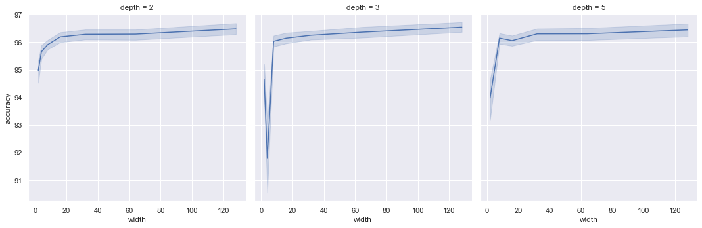
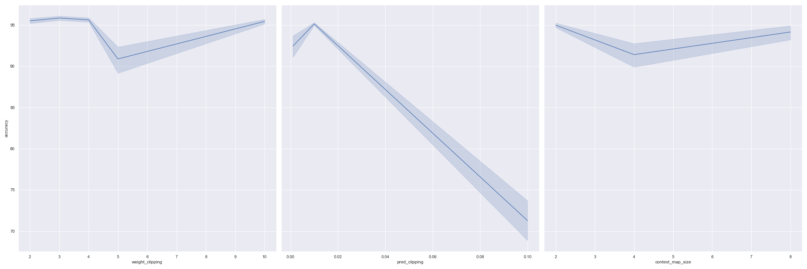
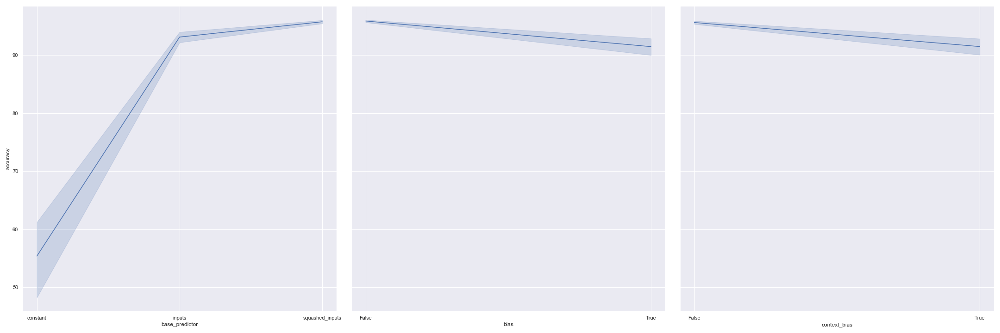

# PyGLN: Gated Linear Network implementations for NumPy, PyTorch, TensorFlow and JAX

Implementations of Gated Linear Networks (GLNs), a new family of neural networks introduced by DeepMind in a recent [paper](https://arxiv.org/pdf/1910.01526.pdf), using various frameworks: NumPy, PyTorch, TensorFlow and JAX.

Published under `GNU GPLv3` license.

- [Installation](#installation)
- [Usage](#usage)
- [GLN interface](#gln-interface)
- [Results](#results)
- [Cite PyGLN](#cite-pygln)


## Installation

To use `pygln`, simply clone the repository and install the package:

```bash
git clone git@github.com:aiwabdn/pygln.git
cd pygln
pip install -e .
```


## Usage

To get started, we provide some utility functions in `pygln.utils`, for instance, to obtain the MNIST dataset:

```python
from pygln.utils import get_mnist

X_train, y_train, X_test, y_test = get_mnist()
```

Since Gated Linear Networks are binary classifiers by default, let's first train a classifier for the target digit 3:

```python
y_train_3 = (y_train == 3)
y_test_3 = (y_test == 3)
```

We provide a generic wrapper around all four backend implementations. Here, we use the NumPy version ([see below](#gln-interface) for full list of arguments):

```python
from pygln import GLN

model_3 = GLN(backend='numpy', layer_sizes=[4, 4, 1], input_size=X_train.shape[1])
```

Alternatively, the various implementations can be imported directly via their respective submodule:

```python
from pygln.numpy import GLN

model_3 = GLN(layer_sizes=[4, 4, 1], input_size=X_train.shape[1])
```

Next we train the model for one epoch on the dataset:

```python
for n in range(X_train.shape[0]):
    pred = model_3.predict(input=X_train[n:n+1], target=y_train_3[n:n+1])
```

Note that GLNs are updated in an online unbatched fashion, so simply by passing each instance and corresponding binary target to `model.predict()`. To speed up training, it can make sense to use small batch sizes (~10).

Finally, to use the model for prediction on unknown instances, we just omit the `target` parameter -- this time the batched version:

```python
import numpy as np

preds = []
batch_size = 100
for n in range(np.ceil(X_test.shape[0] / batch_size).astype(int)):
    batch = X_test[n * batch_size: (n + 1) * batch_size]
    pred = model_3.predict(batch)
    preds.append(pred)
```

As accuracy for the trained model we get:

```python
import numpy as np
from sklearn.metrics import accuracy_score

accuracy_score(y_test_3, np.concatenate(preds, axis=0))
```

    0.9861

As can be seen, the accuracy is already quite high, despite the fact that we only did one pass through the data.

To train a classifier for the entire MNIST dataset, we create a `GLN` model with 10 classes. If `num_classes` provided is greater than `2`, our implementations implicitly create the same number of separate binary GLNs and train them simultaneously in a one-vs-all fashion:

```python
model = GLN(backend='numpy', layer_sizes=[4, 4, 1], input_size=X_train.shape[1],
            num_classes=10)

for n in range(X_train.shape[0]):
    model.predict(input=X_train[n:n+1], target=y_train[n:n+1])

preds = []
for n in range(X_test.shape[0]):
    preds.append(model.predict(X_test[n]))

accuracy_score(y_test, np.vstack(preds))
```

    0.9409

We provide `utils.evaluate` to run experiments on the MNIST dataset. For instance, to train a GLN as a binary classifier for a particular digit with batches of 4:

```python
from pygln.utils import evaluate_mnist

model_3 = GLN(backend='numpy', layer_sizes=[4, 4, 1], input_size=784)

print(evaluate_mnist(model_3, mnist_class=3, batch_size=4))
```

    100%|███████████████████████████████| 15000/15000 [00:10<00:00, 1366.94it/s]
    100%|█████████████████████████████████| 2500/2500 [00:01<00:00, 2195.59it/s]

    98.69

And to train on all classes:

```python
model = GLN(backend='numpy', layer_sizes=[4, 4, 1], input_size=784,
            num_classes=10)

print(evaluate_mnist(model, batch_size=4))
```

    100%|████████████████████████████████| 15000/15000 [00:35<00:00, 418.21it/s]
    100%|██████████████████████████████████| 2500/2500 [00:03<00:00, 764.10it/s]

    94.69


## GLN Interface

### Constructor

```python
GLN(backend: str,
    layer_sizes: Sequence[int],
    input_size: int,
    context_map_size: int = 4,
    num_classes: int = 2,
    base_predictor: Optional[Callable] = None,
    learning_rate: float = 1e-4,
    pred_clipping: float = 1e-3,
    weight_clipping: float = 5.0,
    bias: bool = True,
    context_bias: bool = True)
```

Gated Linear Network constructor.

**Args:**

- **backend** (*"jax", "numpy", "pytorch", "tf"*): Which backend implementation to use.
- **layer\_sizes** (*list[int >= 1]*): List of layer output sizes.
- **input\_size** (*int >= 1*): Input vector size.
- **context\_map\_size** (*int >= 1*): Context dimension, i.e. number of context halfspaces.
- **num\_classes** (*int >= 2*): For values >2, turns GLN into a multi-class classifier by
    internally creating a one-vs-all binary GLN classifier per class and return the argmax as
    output.
- **base\_predictor** (*np.array[N] -> np.array[K]*): If given, maps the N-dim input vector to a
    corresponding K-dim vector of base predictions (could be a constant prior), instead of
    simply using the clipped input vector itself.
- **learning\_rate** (*float > 0.0*): Update learning rate.
- **pred\_clipping** (*0.0 < float < 0.5*): Clip predictions into [p, 1 - p] at each layer.
- **weight\_clipping** (*float > 0.0*): Clip weights into [-w, w] after each update.
- **bias** (*bool*): Whether to add a bias prediction in each layer.
- **context\_bias** (*bool*): Whether to use a random non-zero bias for context halfspace gating.

---

### Predict

```python
GLN.predict(input: np.ndarray,
            target: np.ndarray = None,
            return_probs: bool = False) -> np.ndarray
```

Predict the class for the given inputs, and optionally update the weights.

**Args:**

- **input** (*np.array[B, N]*): Batch of B N-dim float input vectors.
- **target** (*np.array[B]*): Optional batch of B bool/int target class labels which, if given,
    triggers an online update if given.
- **return\_probs** (*bool*): Whether to return the classification probability (for each
    one-vs-all classifier if num_classes given) instead of the class.

**Returns:**

- Predicted class per input instance, or classification probabilities if return_probs set.

## Results

We attempted to replicate the results of the paper on MNIST. The paper does not specify the model architecture exactly. With the `tf` model we achieved `~96%` accuracy on all 10 classes in MNIST in one pass of the data. We present the results from some of our experiments here. We welcome results from other experiments or ideas on how to improve it.

- Varying the **depth and width** of GLNs

    
- Varying **weight_clipping, pred_clipping, context_map_size** of a GLN

    
- Switching **base predictor functions, layer bias and context bias** of a GLN

    

## Cite PyGLN

```
@misc{pygln2020,
  author       = {Basu, Anindya and Kuhnle, Alexander},
  title        = {{PyGLN}: {G}ated {L}inear {N}etwork implementations for {NumPy}, {PyTorch}, {TensorFlow} and {JAX}},
  year         = {2020},
  url          = {https://github.com/aiwabdn/pygln}
}
```
