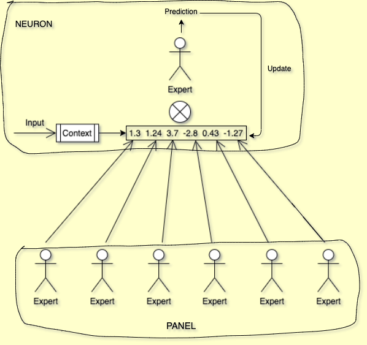
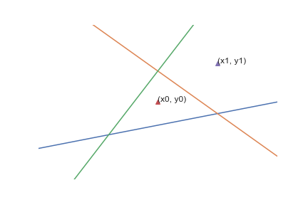
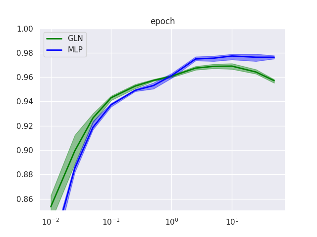
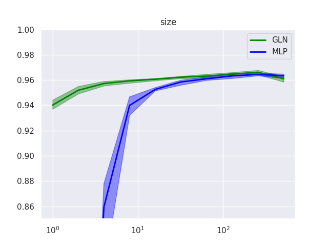
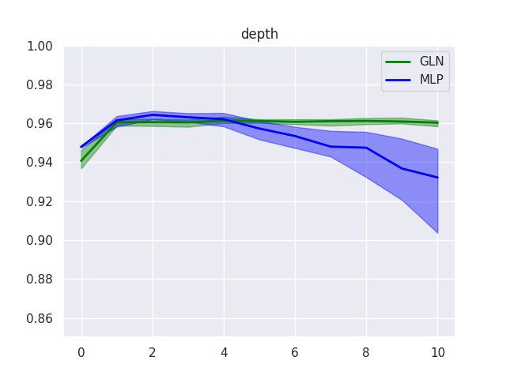
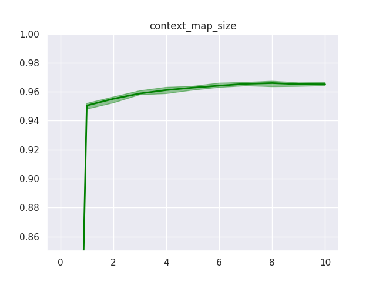
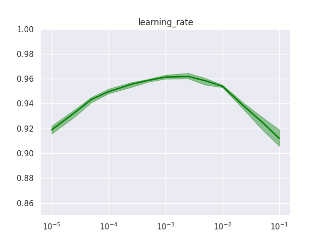
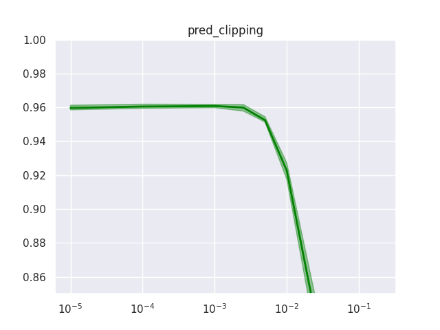
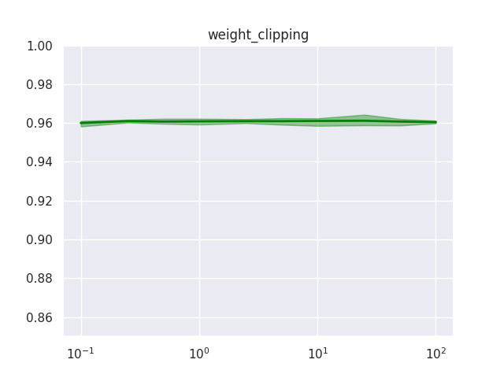

---
# Feel free to add content and custom Front Matter to this file.
# To modify the layout, see https://jekyllrb.com/docs/themes/#overriding-theme-defaults

layout: home
---

<script type="text/javascript" async
  src="https://cdn.mathjax.org/mathjax/latest/MathJax.js?config=TeX-MML-AM_CHTML">
</script>


This blogpost presents intuition and experimental results for Gated Linear Networks, a new family of neural networks introduced by DeepMind in a [recent paper](https://arxiv.org/pdf/1910.01526.pdf). Accompanying implementations in JAX, NumPy, PyTorch and TensorFlow can be found [here](https://github.com/aiwabdn/pygln).


## What is a Gated Linear Network?

A **Gated Linear Network (GLN)** is a collection of **data-dependent neurons**, arranged in a sequence of layers. Instead of predicting the target output only at the final layer, as is usually the case in deep learning, each neuron predicts the output directly, computes the error and updates its weights locally in an online fashion. In the following, we will explain the various components of a GLN in more detail. We will start off by describing how a **neuron** works.

Imagine an expert who, given an input, is supposed to make a **binary decision** and report their prediction as a probability value. This expert considers two types of data when making their decision: the input itself, and a set of prediction probabilities for the same decision from a panel of other experts. The expert then performs the following steps to arrive at their own decision:

1. Conditioned on the input, choose one decision rule from a fixed set of rules which the expert maintains internally. In the paper, this process is implemented as **halfspace gating** and called the **context function**, since the input provides the "context" which determines how the decision is made. This context function is akin to **locality-sensitive hashing**, as similar inputs are supposed to map to the same decision rule.

2. Use the chosen decision rule to combine the prediction probabilities of the panel of other experts. In the paper, each decision rule consists of a set of weights which are used to aggregate the panel probabilities via **geometric mixing**. So the expert effectively refines the decisions of the panel, relying more on some experts than on others, depending on the context, i.e. the input.

3. By comparing their prediction with the expected output, the expert adjusts the selected set of weights which has produced this decision, by shifting them slightly in the direction which encourages the correct decision in the future.

The following awesome stick figure sketch attempts to visualize this:

<div align="center"></div>

We can think of the layers in a GLN as panels of such experts. Each expert/neuron in a layer considers the previous layer as their panel of experts. Consequently, the prediction of the target output gets iteratively refined through the sequence of layers, until a last single-neuron layer makes the final decision, which is taken as the network output. Different from typical deep neural networks, however, the output of each neuron is directly interpretable and updated locally, as opposed to globally via backpropagation through the entire network.


## Core concepts

With that intuition in place, let us look at the main mathematical concepts underlying a neuron in more detail. Henceforth, we will refer to an "expert" as a **neuron** and to a "panel" as a **layer**.


### Halfspace gating

We have seen how each neuron has its own **context function** which it uses to choose a decision rule conditioned on the input. Since the neuron should use the same decision rule for similar inputs, the context function should map regions of the input space to the same context. One way to achieve this is to divide the space into **halfspaces** and compute region membership based on which halfspace an input point belongs to, but other methods, for instance, based on a fixed number of representative points, could be used instead.

Let's consider a two-dimensional input space and an input point $$(x_0, y_0)$$. Any straight line divides the space into two halves, and our point lies either to the left (0) or right (1) of the line. So every line gives us a binary value indicating, very roughly, in which region of the input space our point is located.

<div align="center"></div>

We can consider the point's position relative to multiple lines and combine the binary results to form a binary string. In general, if we draw $$n$$ lines, we get a binary string of length $$n$$ with $$2^n$$ possible values, i.e., sub-regions. This operation forms the basis of how the **context function** computes context identifiers given an input point. A neuron interprets this binary string as number and uses it as index into an array of $$2^n$$ different set of weights, thus making a **data-dependent choice** of which linear function to apply.

In the figure above, the context function consists of $$3$$ lines, shown in red, green and blue, which divide the space into $$2^3 = 8$$ regions, indexed by integers from $$[0, 7]$$. When passed through the context function, input $$(x_0, y_0)$$ produces the binary string *"010"*, i.e. index $$2$$, and point $$(x_1, y_1)$$ produces *"110"*, i.e. index $$6$$.

Let's see how that might look in code.

```python
import numpy as np

# dimensionality of each point in the MNIST dataset
input_size = 784
# length of binary string produced by context function
context_map_size = 3
# lines to partition the input space into regions
context_maps = np.random.normal(size=(context_map_size, input_size))
# helper to convert binary output to index
boolean_converter = np.array([[2 ** i for i in range(context_map_size)[::-1]]])
# number of neurons in the previous layer
previous_layer_size = 4
# array of weights for the Neuron, initialised uniformly as in the paper
weights = np.full(
    shape=(2 ** context_map_size, previous_layer_size),
    fill_value=(1.0 / previous_layer_size)

# 4 random inputs, batch dimension first
inputs = np.random.normal(size=(4, input_size))
# should be of shape (context_map_size, num_samples)
binary_region_indices = (np.matmul(context_maps, inputs.T) > 0).astype(np.int)
# convert to integer index in [0..(2**context_map_size - 1)]
weight_indices = boolean_converter.dot(binary_region_indices).flatten()
# weights chosen to be applied to the previous layer's outputs
selected_weights = weights[weight_indices]

print('region indices in binary: \n', binary_region_indices)
print('target weight indices from context function: \n', weight_indices)
```

    region indices in binary: 
     [[0 0 0 1]
     [1 0 0 0]
     [1 1 0 1]]
    target weight indices determined from context function: 
     [3 1 0 5]


### Geometric mixing

A neuron takes the probabilistic predictions of the previous layer and combines them using the context-selected weights to produce a prediction of its own. This is implemented as **geometric mixing**, that is, a dot product of the weights and the prediction logits of the previous layer and subsequent sigmoid:

$$
\mathrm{GEO}^1_w(p) = \sigma(w^\mathrm{T} \cdot \sigma^{-1}(p)) = \frac{\prod_{i=1}^{d}p_i^{w_i}}{\prod_{i=1}^{d}p_i^{w_i} + \prod_{i=1}^{d}(1 - p_i)^{w_i}},
$$

where $$\mathrm{GEO}^1_w(p)$$ represents the mixed output when the ground truth is $$1$$.

Conceptually, this implements a kind of voting mechanism:

- If all weights are $$0$$, i.e. no weight is given to any input, then the output is $$0.5$$.

- If all weights have the uniform value $$\frac{1}{d}$$ ($$d$$ being the number of neurons in the previous layer), i.e. equal weighting, then the output is the geometric mean of the predictions of the previous layer.

- Moreover, **vetoing** is possible in the sense that if one neuron from the previous layer has predicted a probability close to $$0$$ and the weight assigned to that prediction is greater than $$0$$, then the output is pushed towards $$0$$.

As the neuron sees more samples, it learns which of the predictions of the previous layer to pay more attention to. So in a sense a neuron behaves like an expert who, given a certain type of input, learns the best way to combine decisions from other experts based on their area of expertise, to arrive at their own judgement. This also demonstrates the difference between a GLN and a normal neural network. Usually, the neurons of the intermediate layers of a neural network learn to combine "features" from the previous layers to produce a higher-order "feature" value. However, the features themselves do not have any (extrinsic) semantic meaning or obvious interpretation. That is why the weights of intermediate layers can only be updated via backpropagation after the final output has been computed, since it is the only interpretable value and can thus be optimized. A neuron in a GLN, on the other hand, is directly predicting the output and can consequently learn immediately from its mistakes.


```python
from scipy import special

# assuming random outputs in [0, 1] for neurons in the previous layer
previous_layer = np.random.uniform(size=(num_samples, previous_layer_size))
# dot product
logit = (selected_weights * previous_layer).sum(axis=-1, keepdims=True)
# sigmoid
output = special.expit(logit)

print(output)
```

    array([[0.61196125],
           [0.64587557],
           [0.64513203],
           [0.61447864]])


### Online gradient descent

Now that we know how a neuron chooses weights based on the input, and uses them to mix the outputs of a previous layer of neurons to produce its own output, let's see how it learns to update the weights in training.

Using the standard logarithmic loss, it can be shown that the gradient consists of scaling the difference between the output and the ground truth $$y$$ by the logit of the output probability:

$$
\nabla \mathcal{L}^\mathrm{GEO}(w) = \nabla \big( -\log \mathrm{GEO}^y_w(p) \big) = \big( \mathrm{GEO}^1_w(p) - y \big) \cdot \mathrm{logit}(p).
$$

This value is then multiplied with the learning rate to arrive at the update for the weights used for the current data point by the neuron. This update can be performed for every neuron as soon as it predicts the output, so there is no need for a separate forward and backward pass during training. Contrary to a regular deep neural network, where the loss is computed at the final layer and the gradients are propagated backwards, layer by layer, a GLN will hence not suffer from vanishing/exploding gradients. Moreover, given enough expressive capacity in terms of context dimensions, a GLN will find the best feasible approximation with this version of backpropagation-free gradient descent. This is not possible for neural networks trained with backpropagation, where it can be shown that such a set of weights exist, but it cannot be guaranteed that gradient descent will find it.

So much for theory, let's now move on to our experimental results...


## Experimental results

We have benchmarked our GLN implementations on MNIST (more precisely, a [deskewed version](https://fsix.github.io/mnist/)), compared performance to a standard multi-layer perceptron (MLP), and performed detailed ablation experiments. The scripts used for our experiments can be found in the [gln-experiments](https://github.com/aiwabdn/pygln/tree/gln-experiments) branch of the repo.


### Setup and hyperparameters

First, note that GLNs predict a binary output, so the 10-class MNIST classification task is modeled as 10 one-vs-all binary classifiers. Furthermore, we follow the paper in using the appropriately re-scaled image as base prediction input. Based on preliminary investigations, we chose a 16-16-1 architecture per class and otherwise use the [default hyperparameters in the repo](https://github.com/aiwabdn/pygln/blob/master/pygln/gln.py). Unless explicitly specified, the PyTorch GLN implementation is used in all experiments. For the MLP baseline, also implemented in PyTorch, we chose a 64-10 architecture with tanh activation function and a learning rate of $$2.5 \cdot 10^{-4}$$. Unless specified otherwise, the results are obtained after training for 1 epoch, and we use a batch size of 1 for both the GLN and the MLP baseline. Moreover, results are averaged over 10 runs, and in plots the shaded area indicates minimum and maximum performance across these 10 runs.


### Overall performance for different backends

We observe an accuracy of $$96.1\%$$ after a single pass over the training data, consistently across backends and on par with the MLP baseline. While these results are based on hyperparameters different from the paper, we weren't able to find hyperparameters which replicate the $$98\%$$ accuracy reported in the paper. In terms of runtime, JAX is more than twice as fast, and PyTorch around 7 times as fast as the NumPy implementation. However, the PyTorch version still takes almost twice as long as the MLP baseline. TensorFlow is slightly slower than JAX, and neither had been configured to leverage GPU when we ran this benchmark.

| Backend       | Accuracy | Runtime |
|---------------|----------|---------|
| JAX           | 96.1%    | 257 sec |
| NumPy         | 96.1%    | 570 sec |
| PyTorch       | 96.1%    | 85 sec  |
| TensorFlow    | 96.1%    | 339 sec |
| MLP (PyTorch) | 96.1%    | 48 sec  |

Moreover, evaluating performance over the course of training (up to 50 epochs) shows roughly similar developments for GLN and MLP. On the one hand, this is surprising and intriguing since the optimization mechanisms underlying the two models are quite different. On the other hand, while the paper seems to suggest that GLNs learn quickly (*"...98% accuracy in a single pass of the training data."*), we cannot confirm that they learn substantially faster than a comparable deep learning model. However, we highlight two observations: first, GLNs do indeed exhibit higher performance at the very beginning of training, at around $$1\%$$ of the dataset, and second, whereas the MLP plateaus at around 10 epochs, GLN performance actually deteriorates from that point on. More experiments with different hyperparameter choices would be required to confirm this tendency.

<div align="center"></div>


### Ablation: architecture size and depth

Next, we investigate how performance varies for different architecture choices. Interestingly, GLNs turn out to be comparatively insensitive to layer size and network depth in two respects.

<div style="display: flex; flex-wrap: wrap;">
  <div style="flex: 50%;">
    
  </div>
  <div style="flex: 50%;">
    
  </div>
</div>

1. Training of deeper GLNs does not become less stable. This is likely due to the local nature of its update mechanism, which does not rely on backpropagation and hence is not affected by vanishing/exploding gradients. However, it raises the question whether, conversely, GLNs are capable of benefitting from multiple layers. Performance on MNIST does not seem to improve with depth, but a more complex dataset may be necessary to get a clearer picture.

2. Even very small GLNs achieve an impressive performance level. Already a narrow 4-4-1 architecture reaches an accuracy of $$95.7\%$$. This may be explainable to some degree by the fact that such a GLN really consists of 10 such 4-4-1 networks, so has more parameters than this comparison suggests. However, it is still intriguing that, while performance of a one-layer MLP degrades substantially for a small hidden layer, GLN performance degrades gracefully to the "trivial" $$94.0\%$$ level, which is what the "trivial" zero-depth version of either model achieves.


### Ablation: other hyperparameters

Noteworthy ablation results for the other GLN-specific hyperparameters are:

- The number of halfspaces in the context function (beyond one) does not have a huge effect, but more halfspaces can improve performance slightly, up to a point.

- Enabling halfspace bias, i.e. choosing halfspaces with random offset from zero, decreases performance slightly.

- While discussed in the paper for theoretical reasons, weight clipping does not seem to play a role in practice and prediction clipping is best effectively turned off.

- Performance is sensitive to the learning rate, so needs to be tuned -- and at least in the case of MNIST this seems to be the only hyperparameter for which tuning seems to be crucial.

| Layer bias | Context bias | Accuracy |
|------------|--------------|----------|
| false      | false        | 96.1%    |
| true       | false        | 96.1%    |
| false      | true         | 95.3%    |
| true       | true         | 95.4%    |

<div style="display: flex; flex-wrap: wrap;">
  <div style="flex: 50%;">
    
  </div>
  <div style="flex: 50%;">
    
  </div>
</div>

<div style="display: flex; flex-wrap: wrap;">
  <div style="flex: 50%;">
    
  </div>
  <div style="flex: 50%;">
    
  </div>
</div>


## Further research

[Some](https://arxiv.org/abs/2002.11611) [work](https://arxiv.org/abs/2006.05964) in extending GLNs has already been done by the authors of the paper. Possible future experiments and extensions include:

1. Benchmark performance on bigger datasets, e.g. CIFAR-10.
2. Investigate resilience to catastrophic forgetting by training on multiple tasks.
3. Classification training with a multinomial objective instead of the current one-vs-all setup.
4. Extend GLN training mechanism to convolutional layers.
5. Implement GaussianGLNs as described in [this paper](https://arxiv.org/pdf/2006.05964.pdf) from the authors
6. Train GLNs on top of a standard feature extractor, e.g. ResNet18, for transfer learning
7. Apply GLNs to simple RL tasks

Suggestions for other use cases are always welcome - please raise an issue on the GitHub project!
